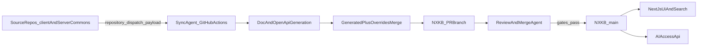

# NX-KNOWLEDGE-BASE Bootstrap Plan

## Scope And Source Repos

- Primary target repo: [client-side/nx-kb](client-side/nx-kb)
- Initial source repos to document:
  - [commons/client_commons](commons/client_commons)
  - [commons/server_commons](commons/server_commons)
- Existing schema baseline to extend (not rewrite from scratch): [client-side/nx-kb/src/docs/schema.ts](client-side/nx-kb/src/docs/schema.ts)
- Existing UI entry points to evolve: [client-side/nx-kb/src/app/(main-router)/docs/page.tsx](client-side/nx-kb/src/app/(main-router)/docs/page.tsx), [client-side/nx-kb/src/app/(main-router)/page.tsx](client-side/nx-kb/src/app/(main-router)/page.tsx)

## Recommended Target Structure (Decision)

- Keep one Next.js app in `nx-kb`; do not create a separate UI repo.
- Add deterministic data layout under `nx-kb`:
  - `repos/<repoName>/docs/**` (mirrors each source `src/**`, JSON only)
  - `repos/<repoName>/openapi/openapi.json`
  - `repos/<repoName>/meta/manifest.json` (commit SHA, generation timestamp, generator version)
  - `overrides/<repoName>/**` (human-authored patch files)
  - `schemas/file-doc.schema.json` and `schemas/openapi.schema.json`
  - `agents/{sync,review}/instructions|skills|commands|style|format/*`
  - `api/ai/*` (stable AI-consumption endpoints)

## Data Contracts And Validation

- Define `schema_version` and `doc_id` as required top-level fields in file-doc JSON.
- Convert the TypeScript contract in [client-side/nx-kb/src/docs/schema.ts](client-side/nx-kb/src/docs/schema.ts) into versioned JSON Schema for CI enforcement.
- Require each internal dependency and symbol location to include both links:
  - `link_to_nx_kb`
  - `link_to_github` (commit-SHA permalink)
- Add strict CI checks:
  - JSON schema validation
  - broken link checks (`nx-kb` deep links + GitHub permalinks)
  - mirror consistency check (every `src` file has one doc JSON)

## Generation And Manual-Edits Preservation

- Use a 3-layer merge model per file:
  1. Generated base JSON (from code + diff)
  2. Human override patch (JSON Patch / merge patch)
  3. Final materialized JSON for UI/API serving
- Store generation metadata per file (`source.commit_sha`, `generated_at_iso`, `generation_confidence`).
- Never write directly into human override files from automation.
- On delete/rename in source repo:
  - generate tombstone/change proposal in PR
  - preserve override history, mark as orphan until approved

## Sync/Review Agent Design (GitHub Actions Only)

- Sync Agent responsibilities:
  - triggered from source repo merge to `develop`
  - receive changed files + diff + metadata
  - regenerate only impacted docs/openapi
  - open PR in `nx-kb` branch
- Review & Merge Agent responsibilities:
  - validate schema, links, override safety, tests
  - auto-fix safe failures (format/schema patchable issues)
  - merge to `main` only when all gates pass
- Agent config must be fully editable without code changes under:
  - `agents/sync/{instructions,skills,commands,style,format}`
  - `agents/review/{instructions,skills,commands,style,format}`

## CI/CD Integration In Source Repos

- Implement a source-repo workflow in both repos:
  - [commons/client_commons](commons/client_commons)
  - [commons/server_commons](commons/server_commons)
- Recommended trigger transport (default): `repository_dispatch` to `nx-kb` with signed payload + optional artifact fallback.
- Payload contract:
  - `repo_name`, `branch`, `commit_sha`, `timestamp`
  - `changed_files[]`, `unified_diff`
  - optional `openapi_hint` (when endpoint files touched)

## UI And AI Access Layer

- UI routing strategy in Next.js app router:
  - `/repos/[repo]/files/[...filePath]` for file docs
  - `/repos/[repo]/symbols/[symbolId]` for symbol pages
  - `/repos/[repo]/openapi` for Swagger UI
- Build a static search index (repo/file/symbol/keywords) regenerated on docs PR merge.
- Add stable machine endpoints:
  - `/api/ai/repos`
  - `/api/ai/repo/[repo]/file/[...filePath]`
  - `/api/ai/repo/[repo]/symbol/[symbolId]`
- Default deep-link behavior: render in `nx-kb` page + explicit `Open in GitHub` button using commit permalink.

## Security, Permissions, And Threat Controls

- Minimal token scopes:
  - source repos: actions read + metadata read
  - `nx-kb`: contents write, pull-requests write, actions read
- Enforce source authenticity:
  - verify sender repo allowlist
  - validate signature/HMAC on dispatch payload
  - reject unsigned or stale timestamps
- Public-repo hardening:
  - no secrets in generated docs
  - secret scanning in CI
  - block accidental env/config leakage from source snippets

## QA, Gates, And Rollout

- Phase 1: schema + mirror + basic UI rendering for both repos.
- Phase 2: diff-based selective generation + overrides merge.
- Phase 3: OpenAPI extraction/inference and UI integration.
- Phase 4: full agentized PR loop with merge gates and hardening.
- Acceptance gates per PR:
  - schema valid
  - links valid
  - no override clobbering
  - deterministic generation output
  - UI build/test passes

## Architecture Flow

## Implementation Anchors In Current Codebase

- Start by aligning existing TS schema in [client-side/nx-kb/src/docs/schema.ts](client-side/nx-kb/src/docs/schema.ts) with JSON Schema + versioning.
- Replace placeholder docs UI screen in [client-side/nx-kb/src/app/(main-router)/docs/page.tsx](client-side/nx-kb/src/app/(main-router)/docs/page.tsx) with repo/file/symbol rendering from generated JSON files.
- Keep current app-shell routing and extend from [client-side/nx-kb/src/app/(main-router)/page.tsx](client-side/nx-kb/src/app/(main-router)/page.tsx).

